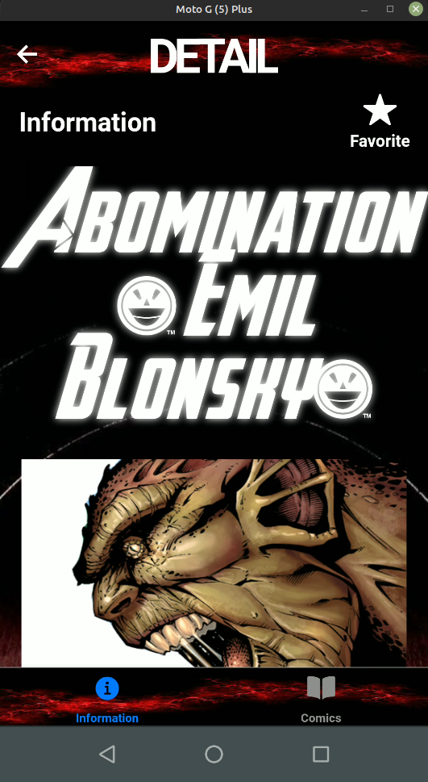
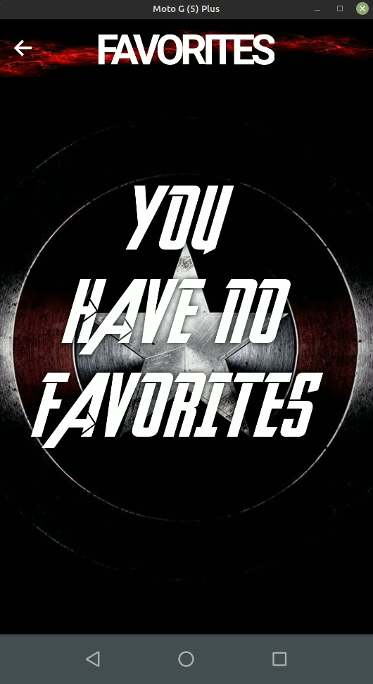

# **Marvel App React Native**

**Mobile application with react native created with expo in which the Marvel API is consumed to show each of the company's characters**

___
## Features

- A list of Marvel characters is shown (Including name and photo)
- Filters the list of characters from an input entered by the user and returns only the characters that start with that word
- You can go to the detail of each character where you can select two subscreens:
    - The name and your photo but also adding the description, number of stories or series
    - The list of comics in which said character appears
- The list of characters is an "infinite" scroll that loads more characters when it reaches the end of the list
- You can add/remove characters to a favorites list and they persist even when you exit the app
- The top status bar is hidden
- Marvel logo font and Avengers font are used, along with Marvel's signature colors

___
## How to start the project?

### First

Add the .env file in the root folder along with the keys provided by [API MARVEL](https://developer.marvel.com/)

~~~
publicKey=
privateKey=
~~~

### Second

Run in terminal in the root folder
~~~
expo install
~~~ 
or
~~~
npm install
~~~

### Third

Take into account the parameters required for the API call. For this it was installed during the installation of packages. Some dependencies like MD5, @env
The process for the api parameters are created in the `config.js` file

### Fourth

Run in terminal in the root folder

~~~
expo start
~~~

___

## Project images

<h4>Home</h4>

 
<h4>Detail</h4>
 
 
<h4>Favorites</h4>
 
 
<h4>Search</h4>
